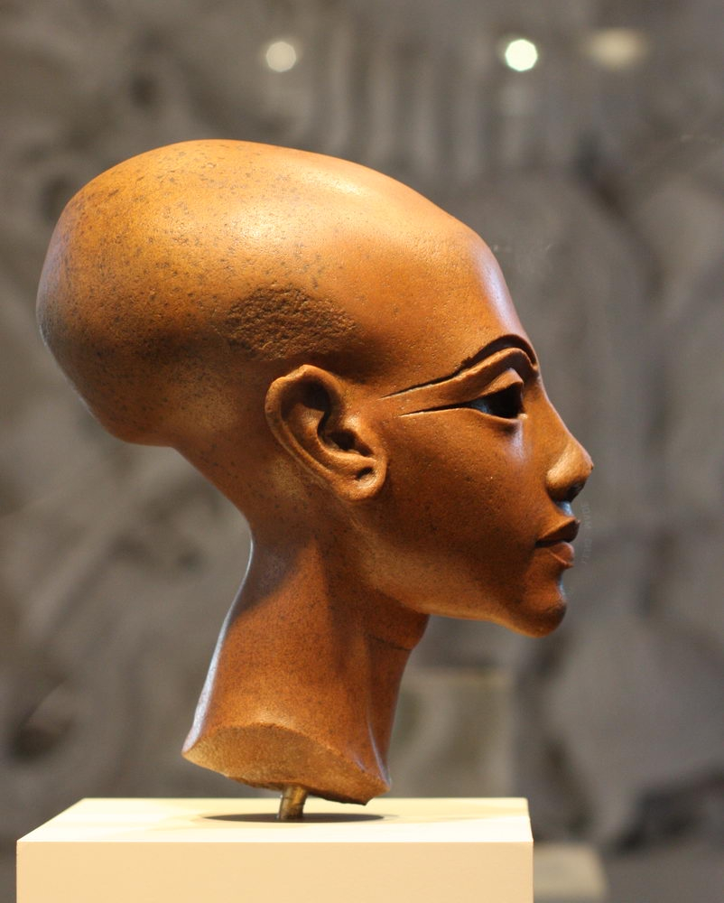

### Средняя школа

В детском саду ещё индивидуальный подход там массово не кодирую. А школа это не то место где учат. Где-то в 3 классе я услышал ГОЛОС АНГЕЛА в духовном мире (то есть когда дети в базовом мире приходят со школы где провели большую часть дня и лягли спать ночью им снится школа) `"ОДИН! ... ДВА! ... ТРИ! ... ЧЕТЫРЕ! ... ВЫ НЕ СВОБОДНЫ! ВЫ НЕ СВОБОДНЫ! ..."` это системный код, я понял что начали кодировать, вначале я обежал весь район кодировали во всех школах и во всех гос учреждениях какой-то дом советов и ще какое-то здание во всех гос зданиях где собирается много людей. поэтому я вернулся в свою среднюю школу вариант с переводом в другую школу отпал, я нашёл источник голоса - учительская в спортзале, там было два мужика помню как они мне обяъсняли я спрашиваю как в кабинет передаёте голос по проводам ? а они мне нет по волне. я про волны ничего не знал. Все говорю им - человека кодировать нельзя сворачивайте свою шарманку и съёбывайте, пришлось вломить одному я бы их обоих запиздел, прибежала тётка кто у нас тут такой талантливый голос ангела услышал короче она мне дала затычки для ушей типа в уши вставь и всё кодироваться не будешь. Так я попал к кодировщикам.

* Ангелы в небе. дети до 7-8 лет (вам не нравятся чужие маленькие дети это может быть не спроста)
* Ангелы на земле. дети до института
* Ангелы в организации. взрослые

Есть такой тип людей в школе это в основном тётки: коренастые, бошкатые (большой размер головы - по шапке узнать можете, у женщин из-за причёски бывает сложно на глаз определить размер головы), с плотным таким телом, тихие(не шумные) ходят внутрь себя, зачастую, смотрят, что-то там рассматривают, и у них смуглая кожа, не загорелая а вот, пипец, смуглая слегка. Это кодировщики у которых отработка за черные дела и ведение чёрной жизни (убийства людей), они работают на государство, сторонитесь их. Если есть возможность лучше в другой класс перевестись. Я их определял как комисарши из расстрельных троек вот надень на неё кажанку вылитая коммисарша.

Так же внимание на училок физкультуры смуглых (в школе с детьми все тётки были). База с волновой аппаратурой не спроста в учительской спортзала была. Они как правило будут вас учить максимум пол года во 2-3-4-может5 классе.

Есть такие люди с большой головой и формой такой вытянутой, тыквоголовыми их называют, они самые главные командуют всеми.

Если подымают руку как в фашистском приветсвии это приветсвие человека, если вы человек и у вас генетика человека у вас инстинк будет срабатывать вас будет порывать автоматом в ответ тоже руку поднять, это как коленочный рефлекс.

Когда вы начнёте учиться в классе 5-6 вас кто нибудь, возможно одноклассник, будет спрашивать какой у тебя любимый предмет, если у вас не будет поворачиваться язык сказать что мой любимый предмет такой-то, это не спроста ), учителя на всех предметах кодируют, если скажете что предмет ваш любимый такой-то рухнет ваша защита от кодирования на этом предмете.

Вообще все школы государственные. Я учился в ссср там вообще людей за косой взгляд и чих расстреливали.

К нам в 1 классе пришла делегация они даже белые халаты одевать не стали, нас всех вывели из класса и построили в шеренгу в коридоре возле класса, тётки прошли вдоль всей шеренги поили с ложечки детей чем то и рисовали на лбу у некоторых кисточкой обмокнутой в жидкость кресты, тех кто не хотел пить с ложечки хлестали по щекам и дети подчинялись.

Так же неоднократно (раз5-6) 1-3 класс делали уколы в руку выводили из класса строили в коридоре в шеренгу приказывали закатать рукав проходили и делали уколы, что за уколы хз животноводы скотине не объясняют.

Была ещё такая херня в пионерской комнате поставили кабинку похожую на кабинку для моментальных фотографий обитую изнутри всем чёрным и с чёрной шторкой, туда водили детей 1 класс прям с урока какой-то мужик забирал заводил в кабинку и заставлял там сидеть 5 минут. (я знаю что это такое и лучше туда не попадать)